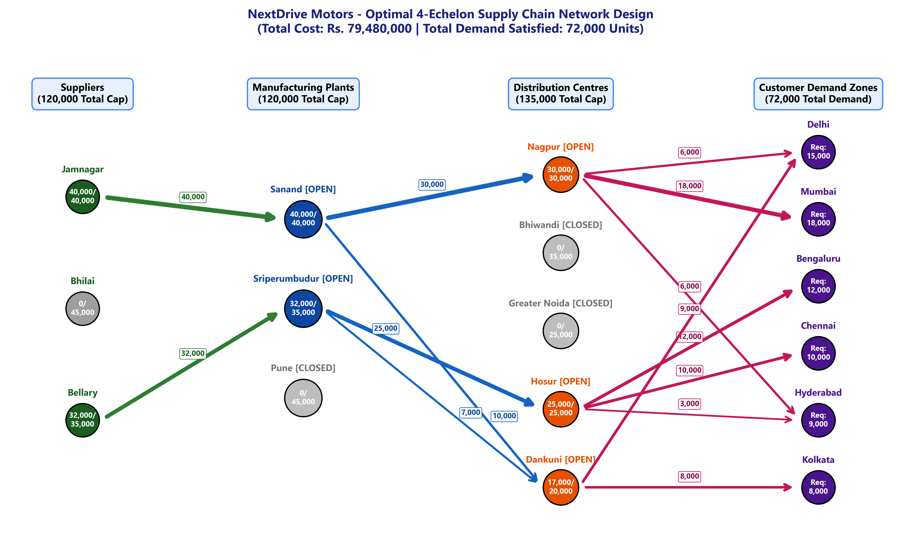
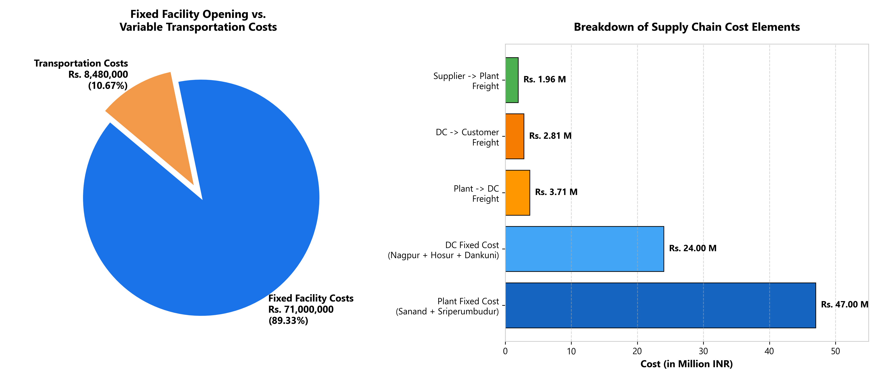
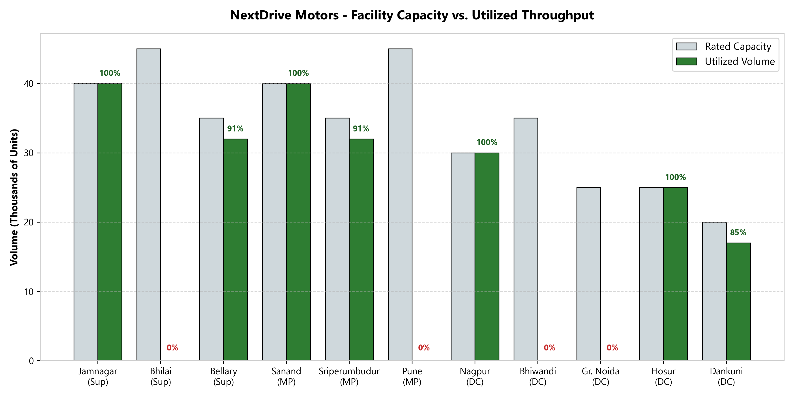
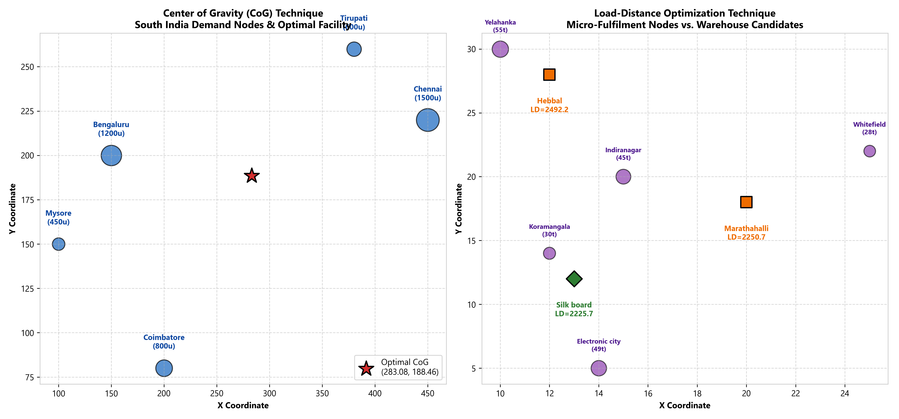
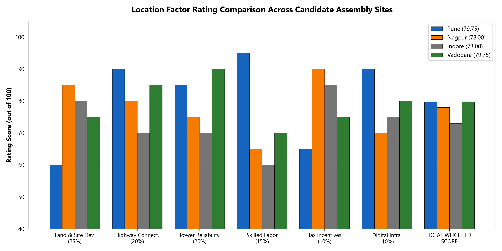

# Supply Chain Network Design & Facility Location Optimization
### NextDrive Motors: 4-Echelon Cruiser Motorcycle Manufacturing & Distribution Network

[](https://www.python.org/)
[](https://coin-or.github.io/pulp/)
[](https://support.microsoft.com/en-us/office/load-the-solver-add-in-in-excel-612926fc-d53b-46b4-872c-e24772f078ca)
[-orange.svg)]()

A comprehensive operations research and supply chain engineering project solving multi-echelon facility location and network design problems using Mixed-Integer Linear Programming (MILP) in Python (PuLP/CBC) and Microsoft Excel Solver.

---

## 📌 Project Overview

NextDrive Motors is establishing an end-to-end nationwide manufacturing and distribution network across India to assemble and deliver its flagship cruiser motorcycle line. 

The supply chain operates across four distinct echelons:
1. **Tier-1 Suppliers ($i \in I$):** Jamnagar, Bhilai, and Bellary (sourcing heavy chassis stampings, body panels, and structural metal components).
2. **Manufacturing Assembly Plants ($j \in J$):** Sanand, Sriperumbudur, and Pune (candidate assembly plants for licensing & commissioning).
3. **Distribution Centres ($k \in K$):** Nagpur, Bhiwandi, Greater Noida, Hosur, and Dankuni (candidate regional vehicle hubs to lease & operate).
4. **Metropolitan Customer Demand Zones ($l \in L$):** Delhi, Mumbai, Bengaluru, Chennai, Hyderabad, and Kolkata (annual dealer demand of 72,000 units).

---

## 🚀 Key Optimization Results

* **Minimum Total Annual Supply Chain Cost:** **Rs. 79,480,000**
  * **Fixed Facility Setup Costs:** **Rs. 71,000,000** ($89.33\%$ of total)
  * **Variable Freight Transportation Costs:** **Rs. 8,480,000** ($10.67\%$ of total)
* **Optimal Assembly Plants (MPs):**
  * **Sanand:** **OPEN** (40,000 / 40,000 units — $100\%$ capacity)
  * **Sriperumbudur:** **OPEN** (32,000 / 35,000 units — $91.4\%$ capacity)
  * **Pune:** **CLOSED** (saves Rs. 28,000,000 in fixed capital licensing)
* **Optimal Distribution Centres (DCs):**
  * **Nagpur:** **OPEN** (30,000 / 30,000 units — $100\%$ capacity)
  * **Hosur:** **OPEN** (25,000 / 25,000 units — $100\%$ capacity)
  * **Dankuni:** **OPEN** (17,000 / 20,000 units — $85.0\%$ capacity)
  * **Bhiwandi & Greater Noida:** **CLOSED** (saves Rs. 19,500,000 in fixed leasing costs)
* **Demand Fulfillment:** $100\%$ of all 72,000 units demanded across all six metropolitan zones are satisfied with zero stockouts.

---

## 🌐 Optimal Network Flow Diagram



---

## 📊 Summary of All Facility Location Techniques Covered

| # | Technique | Context / Dataset | Key Metric / Result | Optimal Decision |
| :---: | :--- | :--- | :--- | :--- |
| **1** | **Multi-Echelon SCND (MILP)** | NextDrive Motors Cruiser Bikes | Min Cost: **Rs. 79,480,000** | Open **Sanand** & **Sriperumbudur** plants; open **Nagpur**, **Hosur**, and **Dankuni** DCs. |
| **2** | **Transportation Model (TM)** | Dallas vs. Chicago Plant Expansion | Dallas: **$219,770**<br>Chicago: **$254,830** | **Open Dallas** ($y_{\text{Dallas}}=1$). Saves **$35,060 (15.95%)** in annual freight over Chicago. |
| **3** | **Location Factor Rating** | Multi-Criteria Qualitative Siting | Pune: **79.75** \| Vadodara: **79.75**<br>Nagpur: **78.00** \| Indore: **73.00** | **Pune and Vadodara tie for Rank 1**. Pune excels in labor skills & highways; Vadodara in power & lower land capex. |
| **4** | **Center of Gravity (CoG)** | Siting Central DC for South India | Demand: 4,550 units<br>$(X^*, Y^*) = (\mathbf{283.08}, \mathbf{188.46})$ | Maps to the **Vellore / Kolar corridor** along NH48 between Bengaluru and Chennai. |
| **5** | **Load-Distance (LD)** | Micro-Fulfillment replenishment (Bengaluru) | Hebbal: 2,492.20<br>Marathahalli: 2,250.65<br>Silk Board: **2,225.67** | **Select Silk Board**. Lowest ton-km score due to immediate proximity to Koramangala (30t) and Electronic City (49t). |

---

## 📈 Visual Cost & Spatial Analytics

| Cost Breakdown & Pareto Analysis | Capacity Utilization Across Facilities |
| :---: | :---: |
|  |  |

| Center of Gravity & Load-Distance Spatial Maps | Factor Rating Multi-Criteria Comparison |
| :---: | :---: |
|  |  |

---

## 📁 Repository Structure

```plaintext
├── Facility location techniques - input data.xlsx   # Fully populated & formulated workbook (Excel Solver ready)
├── solve_assignment.py                              # Standalone Python optimization solver (PuLP/CBC) & visualizer
├── populate_excel.py                                # Script automating openpyxl formula injection across sheets
├── Executive_Summary_Report.md                      # Complete executive report with mathematical proofs & tables
├── fig1_scnd_network_flows.png                      # High-res 4-echelon network flow diagram
├── fig2_scnd_cost_breakdown.png                     # Fixed vs variable cost Pareto analysis
├── fig3_scnd_capacity_utilization.png               # Facility capacity vs utilized throughput chart
├── fig4_spatial_cog_and_ld.png                      # Center of Gravity & Load-Distance spatial plots
├── fig5_factor_rating_comparison.png                # Factor rating comparative bar chart
├── about.txt                                        # Assignment problem prompt and case background
└── README.md                                        # Project overview and documentation
```

---

## 🛠️ Getting Started & Reproduction

### Prerequisites
* Python 3.10+
* Required packages:
```bash
pip install pulp matplotlib openpyxl numpy
```

### Run Optimization Solver & Generate Visuals
```bash
python solve_assignment.py
```

### Excel Solver Verification
Open `Facility location techniques - input data.xlsx` and go to sheet `SCND`:
1. Open **Data > Solver**.
2. Objective: `$J$35` to **Min**.
3. Changing cells: `$B$17:$B$19, $B$22:$B$26, $B$30:$D$32, $B$36:$F$38, $B$42:$G$46`.
4. Engine: **Simplex LP**.
5. Click **Solve**.
